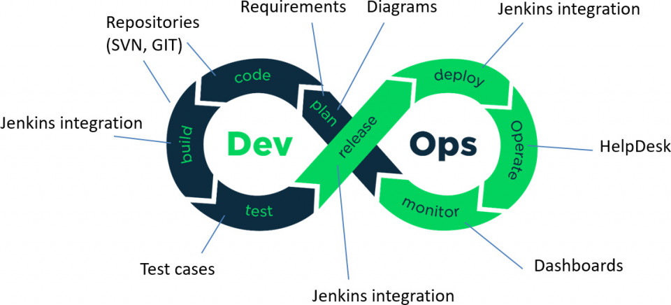
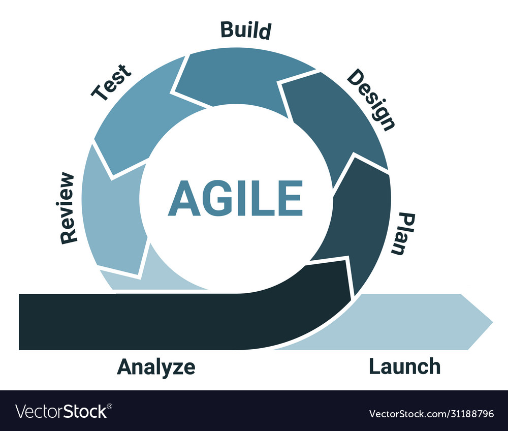
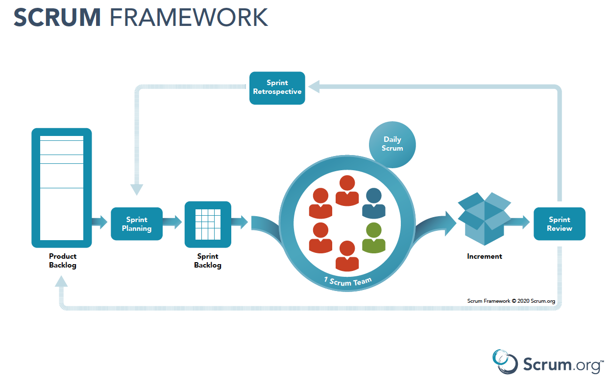
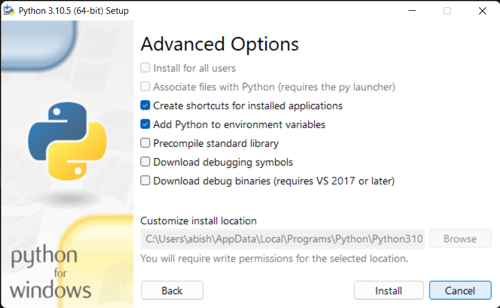
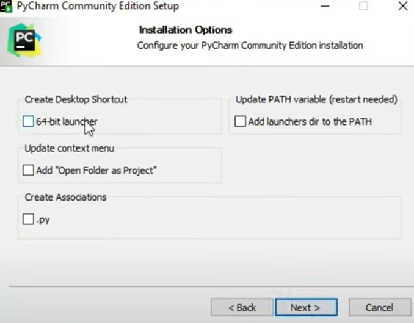
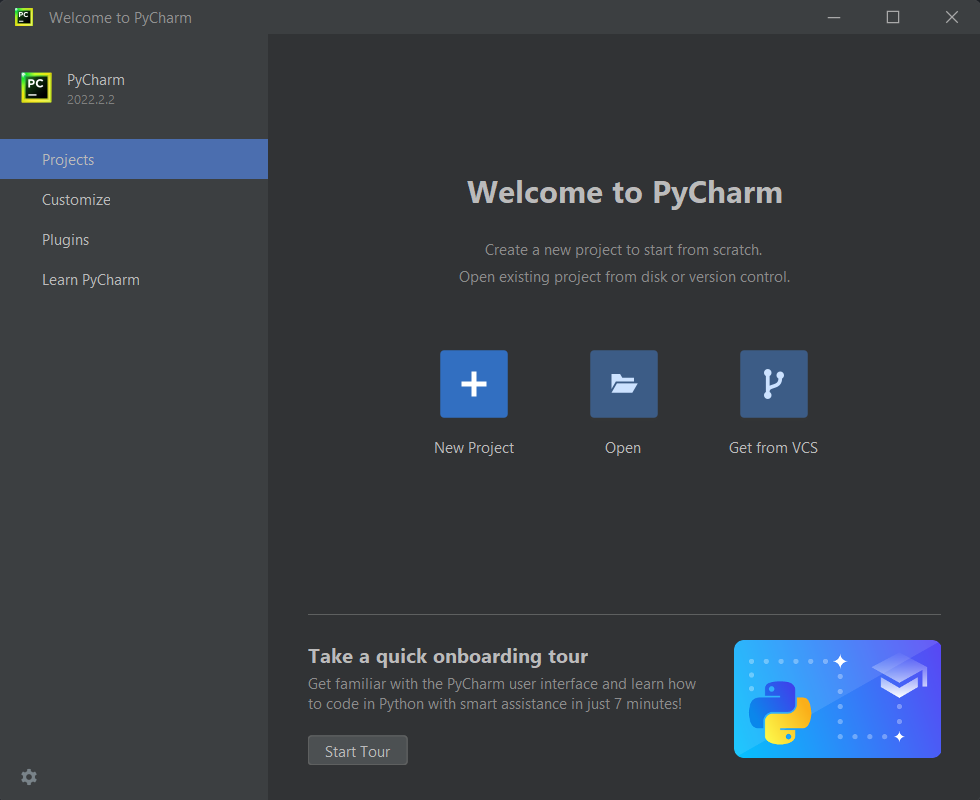
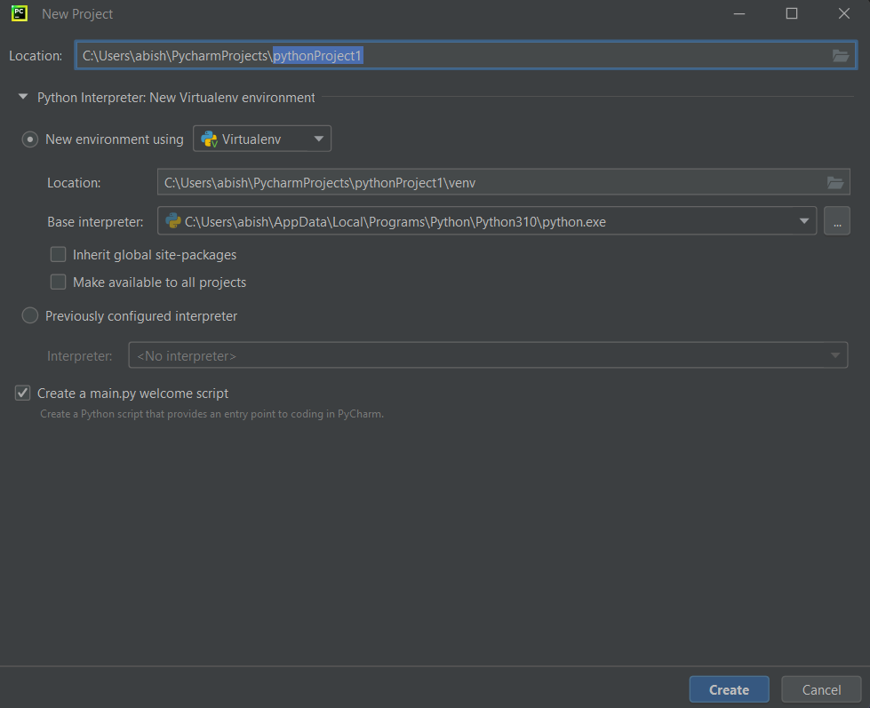

# Week 1

## Elevator Pitch

We were told to create an elevator pitch and we had to present it to the rest of the cohort.
After we had presented our elevator pitch we received very informative feedback from the trainners.

The feedback include points such as:

- The pitch was too long
- The pitch was too technical
- Talk about your experience and what you can offer
- Talk about your personality and hobbies

## Interview Practice

We got put into groups and we had to interview each other and give feedback on how we could improve our interview skills.
This active was very helpful as it gave us the chance to practice our interview skills and get feedback on how we could improve.

The feedback include points such as:

- Speak with more clarity
- Try not to use filler words
- Remove the "um" from my vocabulary

## What is DevOps

We were put into groups and we had to research what DevOps is and present it to the rest of the cohort.
This activity was very helpful as it gave us the chance to learn about DevOps and how it is used in the industry.

Some of the points that we learned about DevOps include:

- DevOps is a set of practices & principles
- DevOps can improve the speed of delivery
- DevOps uses CI/CD and automation to improve efficiency
- DevOps can reduce the cost of delivery

## An introduction to Agile and Scrum

### What is Agile?

Agile is a set of principles and practices that help teams deliver value to their customers faster and with higher quality. Agile is a mindset, a way of thinking and working.
Agile is a way of thinking and working that helps teams deliver value to their customers faster and with higher quality.

Some key principles of Agile include:

- Working software over comprehensive documentation
- Customer collaboration over contract negotiation
- Responding to change over following a plan
- A project is broken down into smaller pieces of work.
- Each piece of work is assigned a tag that describes its priority.
- The team works on the highest priority piece of work first.

### What is Scrum?

Scrum is a framework within which people can address complex adaptive problems, while productively and creatively delivering products of the highest possible value. Scrum is a framework for getting work done.

Some of the roles in Scrum include:

- Product Owner
- Scrum Master
- Development Team

Some of the events in Scrum include:

- Sprint Planning
- Daily Scrum
- Sprint Review
- Sprint Retrospective

## How to install Python 3 and Pycharm

### Installing Python 3

To install Python 3 on your machine you can follow the steps below:

1. Go to the [Python Website](https://link-url-here.org) and download the latest version of Python 3(x64).
2. Once the download has finished, open the file and follow the installation steps.
3. To check if Python has been installed correctly, open your terminal and type in the following command: `python --version`

**_NOTE:_**  Check the Python added to your PATH environment variable.

### Installing Pycharm

To install Pycharm on your machine you can follow the steps below:

1. Go to the [Pycharm Website](https://link-url-here.org) and download the latest version of Pycharm.
2. Once the download has finished, open the file and follow the installation steps.

**_NOTE:_**  Make sure you check the `.py` and `Add Launchers dir to the PATH` options. This may require you to restart your machine.

3. To check if Pycharm has been installed correctly, open Pycharm and you should see the following screen:

Click on the "New Project" button and you should see the following screen:

Make sure that "Base Interpreter" is set to the right Python version and click on the "Create" button.
